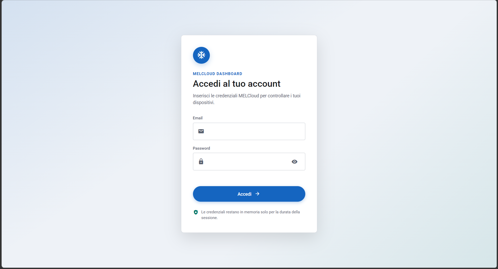
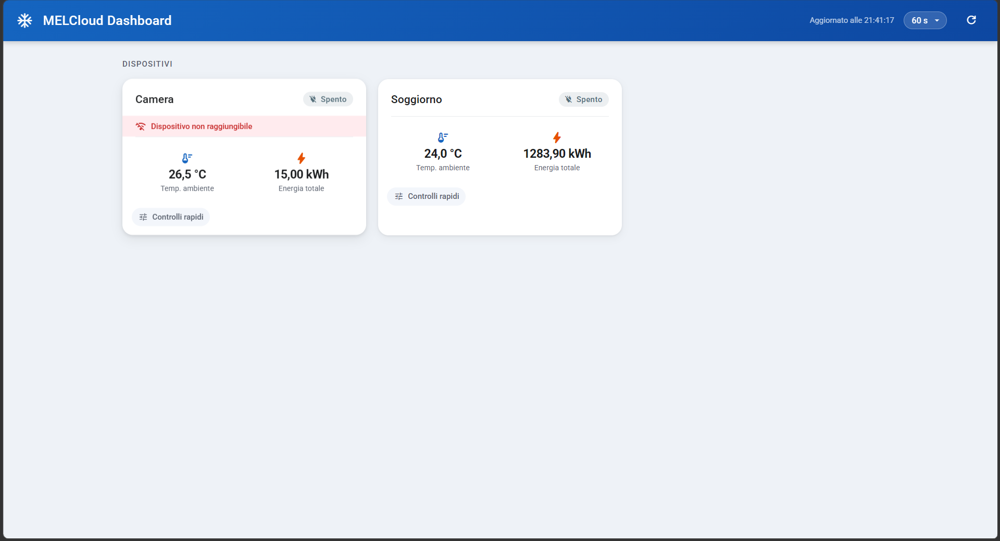
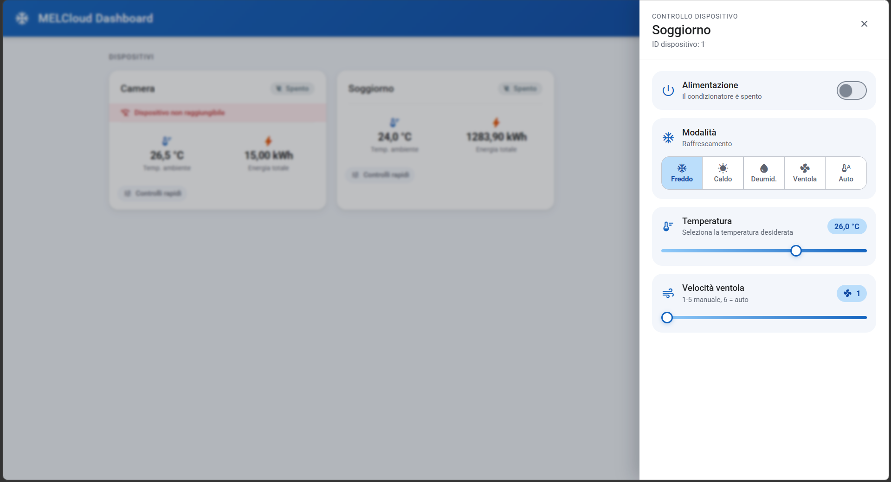
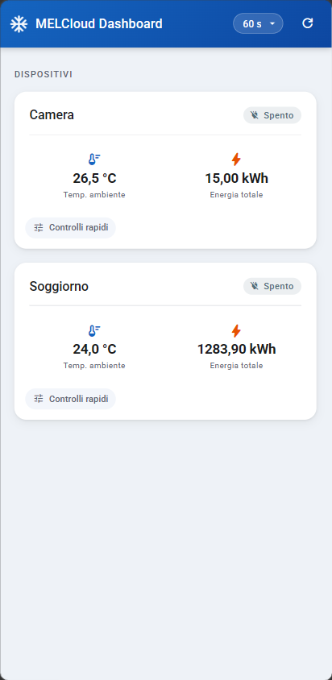
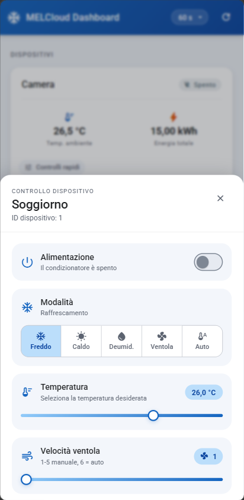

[Versione italiana](README.it.md)

# MELCloud Controller (Node.js + TypeScript)

Functional scaffold and web dashboard for controlling a Mitsubishi air conditioner through MELCloud using the `melcloud-api` library.

Supports two providers:

- `pigwin` (`melcloud-api`, deprecated)
- `olivier` (`@olivierzal/melcloud-api`, installed from GitHub)

## Screenshots

The interface follows the browser language; the screenshots below show the Italian version.

| Login | Devices | Device controls |
| :---: | :---: | :---: |
|  |  |  |

On mobile, the controls open in a bottom sheet:

<p align="center">
  
  &nbsp;&nbsp;
  
</p>

## Requirements

- Node.js 20+
- Valid MELCloud credentials for each account accessing the application

## Setup

1. Copy the environment file:

   ```bash
   cp .env.example .env
   ```

2. Choose the authentication mode:

  - leave `MELCLOUD_EMAIL` and `MELCLOUD_PASSWORD` empty to display the login page and use different credentials for each web session;
  - fill in both values to use a single shared account and open the dashboard directly.

  Credentials entered through the form remain only in the process memory and are deleted on logout, when the session expires, or when the server restarts. They are not saved in the browser or in the `.env` file.

3. If `MELCLOUD_PROVIDER` is not set, the server defaults to `olivier`.
  Alternatively, set `MELCLOUD_PROVIDER=pigwin` or `MELCLOUD_PROVIDER=olivier`.

  In production, also set a long, random value for `SESSION_SECRET`; if omitted, one is generated at every startup and all sessions are invalidated when the server restarts.

4. Start in development mode:

   ```bash
   npm run dev
   ```

## Scripts

- `npm run dev`: starts watch mode with `tsx`
- `npm run check`: TypeScript type-check
- `npm run build`: builds to `dist/`
- `npm run start`: runs the build output

## Available endpoints

- `GET /health`
- `GET /api/auth/status` returns the session status
- `POST /api/auth/login` with JSON body `{ "email": "...", "password": "..." }`
- `POST /api/auth/logout`
- `GET /api/devices` returns the complete device JSON
- `GET /api/devices/summary` returns a compact summary with: `id`, `name`, `Power`, `SetTemperature`, `FanSpeed`, `SetFanSpeed`, `RoomTemperature`, `CurrentEnergyConsumed`, `Offline`, `OperationMode` and the supported-mode flags `CanCool`, `CanHeat`, `CanDry`, `CanAuto`
- `GET /api/devices/:id` returns the complete JSON for a device
- `POST /api/devices/:id/power` with JSON body `{ "on": true }`
- `POST /api/devices/:id/set` with a JSON body containing `setDevice` parameters

### cURL examples

With shared credentials in `.env`, device endpoints can be called directly. In login mode, first save the session cookie and reuse it:

```bash
curl http://localhost:3000/health

curl -c cookies.txt -X POST http://localhost:3000/api/auth/login \
  -H "Content-Type: application/json" \
  -d '{"email":"user@example.com","password":"password"}'

curl -b cookies.txt http://localhost:3000/api/devices

curl -b cookies.txt http://localhost:3000/api/devices/summary

curl -b cookies.txt -X POST http://localhost:3000/api/devices/123456/power \
  -H "Content-Type: application/json" \
  -d '{"on": true}'

curl -X POST http://localhost:3000/api/devices/123456/set \
  -H "Content-Type: application/json" \
  -d '{"temperature": 22, "mode": "heat", "fanSpeed": "auto"}'
```

## Translations

All user-facing texts (web pages and the API error messages shown in the UI) live in a single file, `public/i18n/strings.json`. Each entry has an identifier and one value per language:

```json
"login.title": {
  "it": "Accedi al tuo account",
  "en": "Sign in to your account"
}
```

The page language follows the browser preferences: Italian browsers get Italian, English browsers get English, and any other language falls back to `defaultLanguage` (English). The API picks the language from the `Accept-Language` header in the same way.

- **Static HTML**: mark elements with `data-i18n="key"` (text), `data-i18n-title="key"` or `data-i18n-aria-label="key"`.
- **JavaScript**: use `I18n.t('key', { name: value })`; `{name}` placeholders are replaced with the given values.
- **Server**: use `translate(req, 'key')` from `src/i18n.ts`.

To add a language, add its code to `languages` and a value with that code to each entry. Missing values fall back to the default language.

## Docker

A ready-made image is published on GitHub Container Registry (`ghcr.io/edoardopauletto/melcloud-dashboard`) for `amd64` and `arm64`, so there is no need to download the source code.

### Prerequisites

- [Docker](https://docs.docker.com/get-docker/) installed

### Quick start with Docker Compose

1. Download `docker-compose.yml` from the most recent release on the [Releases page](https://github.com/EdoardoPauletto/melcloud-dashboard/releases) and save it in an empty folder.
2. Optional: next to it, create an `.env` file from [`.env.example`](.env.example) to set a shared MELCloud account, a different port (`PORT`) or the [reverse proxy](#reverse-proxy) options. Without it, the dashboard asks each user to sign in with their MELCloud account.
3. From that folder, start the container:

   ```bash
   docker compose up -d
   ```

4. Open http://localhost:3000 in the browser.

To update to the latest version:

```bash
docker compose pull
docker compose up -d
```

To stop the container:

```bash
docker compose down
```

To view live logs:

```bash
docker compose logs -f
```

### Manual image build

To build the image from the source code instead of using the published one:

```bash
# Build
docker build -t melcloud-dashboard .

# Start
docker run -d \
  --name melcloud-dashboard \
  --restart unless-stopped \
  -p 3000:3000 \
  --env-file .env \
  melcloud-dashboard
```

### Docker notes

- The image uses a multi-stage build: TypeScript sources are compiled during the build stage, and only the necessary files are copied into the production stage, keeping the final image lightweight.
- The container runs as an unprivileged user (`node`) for security.
- The `.env` file is never included in the image; it is read at runtime by Docker Compose or through `--env-file`.
- With Docker Compose, `PORT` in `.env` sets the port exposed on the host; inside the container the app always listens on `3000`.
- A new image is published automatically for every GitHub release (`.github/workflows/docker-publish.yml`), tagged with the release version and `latest`.

### Reverse proxy

If HTTPS terminates at the reverse proxy and the container receives HTTP traffic, add these values to `.env`:

```env
TRUST_PROXY=true
SESSION_SECRET=a-long-random-persistent-string
```

Forward the `X-Forwarded-Proto` header (it is normally set automatically) and configure the destination as `http://localhost:3000`. Keep `SESSION_SECRET` unchanged across container rebuilds and restarts. Publish the app on a dedicated hostname or at `/`: app URLs do not support a path prefix such as `/melcloud`.


## Notes

- Neither `melcloud-api` library is official.
- The `@olivierzal/melcloud-api` library requires Node 22.19+ (it may work with earlier versions, but that configuration is not officially supported).
- Avoid aggressive polling to respect MELCloud limits.
- NEVER commit the `.env` file.

## TODO

- ~~Determine which values are expected for fan speed (possibly 1 to 5 plus "auto");~~ ✅
- ~~Add the fan speed selector;~~ ✅
- Determine which values are expected for vertical and horizontal deflector adjustment;
- Add deflector selectors (some devices also support "swing" mode);
- ~~Determine how many operating modes there are and what they are~~ ✅ (heat 1, dry 2, cool 3, fan 7, auto 8);
- ~~Add a switch to change between "cooling" and "heat pump" modes~~ ✅ (operating mode selector)

### Additional features (Nice-to-have)

- Add features such as frost protection, timers, and vacation mode;
- Improve the temperature slider to make it easier to use
